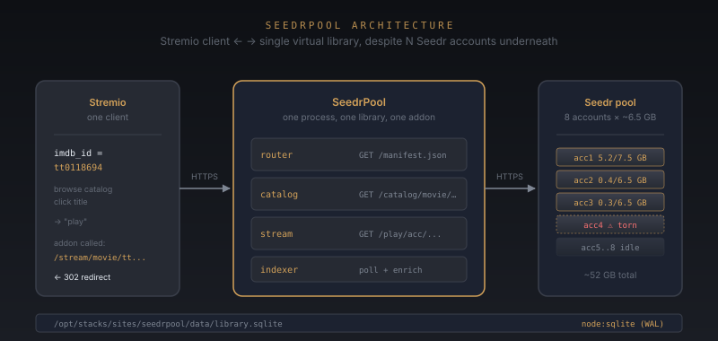

<div align="center">


# SeedrPool

**One Stremio library. Many Seedr accounts. Zero copy-paste between them.**

[](LICENSE)
[](https://nodejs.org)
[](https://www.typescriptlang.org)
[](tests)
[](https://stremio.com)
[](package.json)

SeedrPool makes **N Seedr.cc accounts behave as one** Stremio library. Add
a magnet once; it lands on the right account; the right Stremio user
sees it. No torrent search, no scraping, no second dashboard — a
focused tool for the operator who already has a Seedr fleet.

[**Quick start**](#quick-start) · [**How it works**](#how-it-works) · [**Architecture**](docs/ARCHITECTURE.md) · [**Install**](docs/INSTALL.md) · [**Operations**](docs/OPERATIONS.md) · [**API**](docs/API.md)

</div>

---

## Why SeedrPool exists

Seedr's web UI and mobile app are built around **one account, one
library**. The Stremio addon protocol assumes the same: one addon, one
library. If you operate two or more Seedr accounts — a personal one, a
shared one with a friend, a test account — you can't realistically use
either through Stremio. You either juggle manifest URLs or stay in
Seedr's own UI.

SeedrPool is a small Node process that sits in front of a fleet of Seedr
accounts and pretends to be one. It exposes a single Stremio addon URL.
Behind that URL, an indexer walks every account, dedupes by file name,
resolves IMDb ids via TMDB, and serves streams from whichever account
has the file. The operator's friend sees one library; the operator
sees eight accounts behind the scenes.

## Features

- **One addon URL, one library, N accounts.** Add a magnet in the
  operator console; it lands on the account with the most free space.
- **Stremio deep links** on every row, ready to paste into Stremio's
  addon search.
- **Direct + HLS streaming.** Default CDN is the Seedr `ff_get` URL;
  accounts whose CDN returns 404 (the "torn reel" case) fall back to
  the file's HLS playlist automatically.
- **Live activity log** with filters for account, kind, and time
  range. Every operator action is recorded.
- **CDN-health quarantine** — accounts with a freshly-404'd CDN are
  paused from new content for 30 minutes, then retried.
- **Multi-magnet paste** in the ingest form. One per line.
- **Inline form actions** with no full page navigation. The operator
  console feels like a single-page app but ships zero JS to the
  browser.
- **Zero runtime dependencies.** `node:sqlite` and `fetch` from Node 24.
  `npm install` is for `tsc` and `vitest` only.

## Quick start

```bash
git clone https://github.com/JayeshVegda/SeedrPool
cd SeedrPool
npm install
npm run build
```

Add one Seedr account per line of `seedrpool-credentials.txt`. There is no
hardcoded maximum — the pool is a Map. 8 is the seedr.zayu.dev deploy,
50 is comfortable, 100 is fine if your Seedr V1 quota holds. Account ids come
from line position (`accN`), so remove accounts through the admin rather than by
hand: it leaves a `#deleted accN` tombstone that stops the accounts below from
being renumbered out from under the library index.

Set up the secrets:

```bash
mkdir -p ../.secrets
echo 'acc1@example.com:password1' > ../.secrets/seedrpool-credentials.txt
echo 'acc2@example.com:password2' >> ../.secrets/seedrpool-credentials.txt
echo 'your-addon-secret-string' > ../.secrets/seedrpool-addon-secret
chmod 600 ../.secrets/*
```

```bash
cd /opt/stacks/compose/seedrpool
docker compose build
docker compose up -d
docker compose logs --tail=20 seedrpool
```

The manifest URL prints in the logs. Paste it into **Stremio → Add-ons →
Community → paste manifest URL**. The full [install guide](docs/INSTALL.md)
covers Caddy, Cloudflare, env vars, and the runtime layout.

## How it works

1. **On boot**, SeedrPool probes every Seedr account with the V1
   password grant (`client_id=seedr_chrome`) and reports the result.
2. **Initial scan** walks every account's folder tree, normalizes file
   names to a `title_key`, and upserts `titles` + `files` rows in
   `node:sqlite` (WAL).
3. **Transfer watcher** polls each account every 30 seconds. When a
   transfer disappears, that account is re-scanned and the new files
   pick up the indexer.
4. **Enricher** runs TMDB search on each unindexed title. IMDb id is
   written to the row, the indexer's `setOnScanComplete` hook triggers
   it within seconds of a new file landing — not on a 30-min poll.
5. **Stremio client** browses `/<secret>/catalog/movie/...` and gets
   IMDb-id entries. Clicking one calls
   `/<secret>/stream/movie/tt...`; the addon returns a 302 redirect to
   the Seedr CDN URL (or the HLS playlist if the CDN is torn).



## Project layout

```text
SeedrPool/
├── src/
│   ├── addon/           Stremio addon endpoints (manifest, catalog,
│   │                    meta, stream, subtitles, play)
│   ├── admin/           basic-auth operator console + html tagged template
│   ├── core/            pool, watcher, router, rate-limiter, config,
│   │                    credentials, token-store, types
│   ├── library/         indexer, parser, store, enricher, TMDB client
│   ├── providers/       seedr-v1 (the only viable path), seedr-v2 (legacy)
│   └── index.ts         wiring: pool, indexer, enricher, watcher, server
├── tests/               mirrors src/ subdirs; 246 tests across 15 files
│   ├── addon/
│   ├── admin/
│   ├── core/
│   ├── library/
│   └── providers/
├── docs/
│   ├── ARCHITECTURE.md  design notes + system map
│   ├── INSTALL.md       Docker / Node / Caddy / env vars
│   ├── OPERATIONS.md    day-to-day (add account, purge, torn reel)
│   └── API.md           Stremio addon + admin console endpoints
├── assets/              inline SVG logo + architecture diagram
├── .github/workflows/   CI (typecheck + tests)
├── Dockerfile           multi-stage, runtime image has no toolchain
├── package.json         one runtime dependency (parse-torrent-title)
├── tsconfig.json        strict mode + noUncheckedIndexedAccess
├── LICENSE              MIT
├── CONTRIBUTING.md      what the operator will and won't accept
└── CHANGELOG.md         version history
```

## Development

```bash
npm run typecheck   # tsc --noEmit
npm test            # vitest run (246 tests)
npm test:watch      # vitest (re-runs on change)
npm run build       # tsc → dist/
npm start           # node dist/index.js
```

CI runs on every push and PR to `main`:
typecheck → vitest → docker build. All three must pass.

## License

[MIT](LICENSE) — Copyright (c) 2025 Jayesh Vegda
